# Welcome to the (7/5/3) Game of Rows!

This game is played in turns by a player and the computer. The Initial Board shows three rows under each other.
Each row has a different number of units: 7, 5 and 3. In order to win, the player has to choose a row and take any 
number of available units from it. The objective is to have the opponent pick the last unit, as the one who takes the 
final unit loses the game. 

Visit the site [here](https://p753-89138808fc35.herokuapp.com/).

## Table of Contents

1. [Design](#design)
2. [Features](#features)
3. [UX](#ux)
4. [Testing](#testing)
5. [Technologies Used](#technologies-used)
6. [Credits](#credits)

## Design

The game is implemented in Python and utilizes basic input validation, error handling and randomization for the computer moves.
I added termcolor to my requirements and imported colored, copy and random python libraries.

### Flowchart

The flowchart was created using [whimsical](https://whimsical.com/). It provides a visual overview of the 
logical steps followed while coding/ playing the game. 

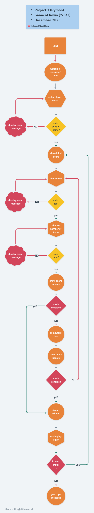

## Features

- **Welcome Message**
    - The game starts with a welcome message
    - The rules are explained, how to play and how to win
    - To start the game, the user is prompted to enter his/her name
  
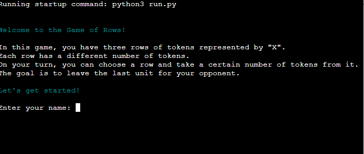

- **Username validation**
    - The name field must not be empty
    - The user is allowed to only use alphabetic characters
    - If an invalid username is entered, an error message appears in red color
    - The user is asked to enter a valid username again

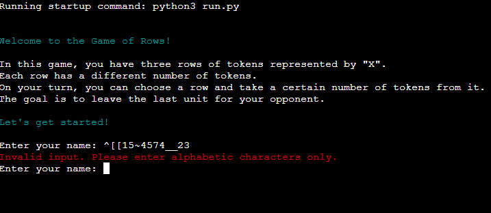

- **Initial board**
    - After entering a valid username, the Initial board is displayed showing the three rows with each 7, 5 and 3 units.
     
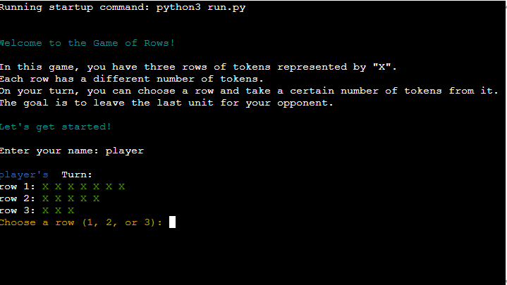

- **Playing the game**
    - The user is requested to choose one row (1, 2 or 3).
    - If the user enters an invalid number or sign, an error message is displayed in red color.
    - The input can not be alphabetic characters, a non-existing row or an empty row.
    - The user is asked to enter a valid number.

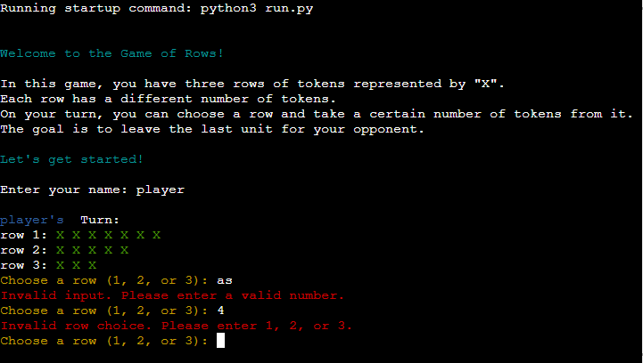
  
  - After entering a valid row number, the user is asked to take any number of units from the chosen row.
  - If an invalid entry is made, an error message is displayed in red color.
  - The input is not valid if alphabetic characters are entered, or if the number of tokens entered exceeds 
the available tokens in the chosen row, or if the total number of tokens in the last remaining row are chosen.
  - The user is prompted to enter a valid number.

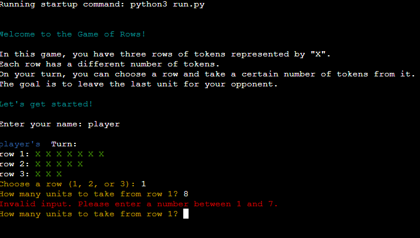, 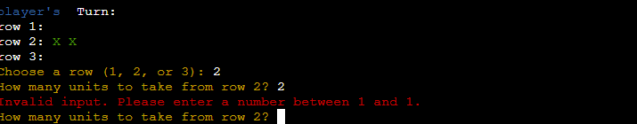

  - When a valid number is entered, the board is updated showing the remaining units in each row.
  - The computer takes its turn, showing an info message about its choice.
  - The board is being updated again and the player is asked to take his turn.
  - The game continues with alternating turns, until only one unit remains on the board.

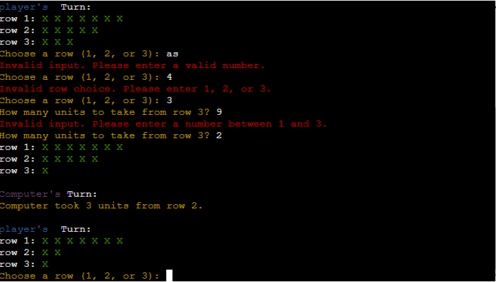

- **How to win**
    - The Player, who has to pick the last remaining unit, loses.
    - Once there is a winner, a message is displayed stating who wins. 
    
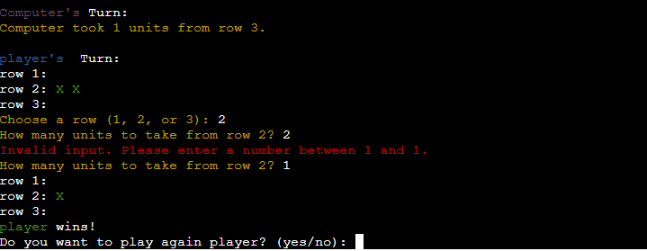

- **Play again/ end of game**
    - When a winner is announced, the user is asked if he/she would like to play again.
    - If the user enters y or yes to play again, the game starts again with the Initial board.
    - If the user enters any other key, the game exits and a personalized goodbye message is displayed.

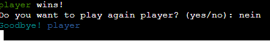

### Possible Future Features

- As of now, the computer is taking its turns based on randomized choice. In the future I would like to 
implement a strategic and logic aim for the computer to make moves that lead to a winning position, forcing the 
player to pick the last unit, mixed with some randomization to make the game more dynamic.

## UX

**Personalized Username:** Users can enter their name for the player.

**Clear Instructions:** The game provides clear instructions and prompts on how to play, including choosing rows and taking units. 

**Error Messages:** Error Messages are displayed in case of invalid input.

**Engaging Gameplay:** The random moves of the computer opponent add an element of surprise and strategy to the game.

**Colorful Interface:** The game utilizes the termcolor library to enhance the user interface with colored text.

### Site Goals

**As the site administrator:**
- The overall aim is to create a challenging and unpredictable competitive game against a 
computer opponent that provides a fun and strategic experience.

### User Stories

**As a visitor:**
- I want to be greeted with the game's name upon arriving.
- I want to be addressed by my chosen username.
- I want to receive clear instructions on how to play and win the game.
- I want to be able to easily understand the game rules and objectives.
- I want to be prompted with informative error messages if I enter invalid input.
- I want to be asked if I would like to play again or to exit the game after each game.
- I want to engage in an interactive and challenging game that involves strategic decision-making. 
- I want a visually appealing interface that enhances my gaming experience. 
 

## Testing

- The game has undergone testing with users to assess the overall playability, basic functionality
and to identify potential improvements on my local terminal and the Code Institute Heroku terminal.

### Fixed Bugs

**Preventing Empty Row Issue**
- In the game, it was crucial to prevent a scenario where the player or the computer 
could take all the units from the last remaining row, leaving no tokens for the opponent. 
To address this issue, I implemented the "units_left" function.
- The "units_left" function calculates the total number of remaining units on the game board. By checking 
the sum of units across all rows, it ensures that there are tokens available for players to take. 
This function is utilized throughout the game logic to validate the number of units a player can take.

**Preventing player from invalid inputs**
- The "try-except" block ensures valid user input for row selection. It attempts to convert the input
to an integer, checks its validity, and handles errors.

### Unfixed Bugs

- None.

### Validator Testing

- [PEP8 Python Linter](https://pep8ci.herokuapp.com/#) initially showed a number of whitespaces, too long lines and line break errors, which were all fixed.
- [Chrome DevTools Lighthouse](https://chromewebstore.google.com/detail/lighthouse/blipmdconlkpinefehnmjammfjpmpbjk?pli=1)

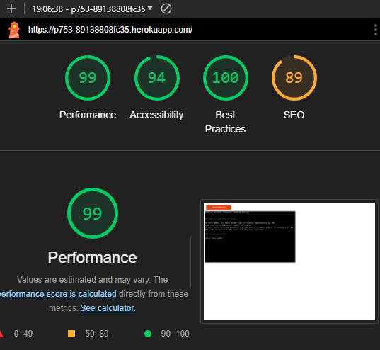

### Browser Testing 

The game was tested on the following browsers:
- Microsoft Edge (Desktop)
- Brave (Desktop)
- Microsoft Edge (Android Mobile)
- Google Chrome (Android Mobile)
- Firefox (Android Mobile)
- Opera (Android Mobile)

### Manual Testing of Logic and Input Validation
**Alphabetic Username:**
- Test: Verify that the game only accepts alphabetic characters for the player's username.
- Procedure: Enter a username containing numeric characters, symbols, or an empty username.
- Result: The game rejects the input, displays an error message, and prompts the user to enter a 
valid alphabetic username.

**Numeric Input Validation:**
- Test: Check that the game rejects non-numeric input during row and unit selection.
- Procedure: Enter alphabetic characters or symbols when prompted for row and unit selection.
- Result: The game catches the error, prompts the user to enter a valid number, and does not proceed 
until a numeric input is provided.

**Valid Row/ Unit Selection:**
- Test: Ensure that the player can only select valid rows (1, 2, or 3) and available units.
- Procedure: Attempt to select rows/ units outside the valid range and verify the game's response.
- Result: The game rejects invalid row/ units selections and prompts the user to make a valid selection.

**Non-Empty Row Selection:**
- Test: Confirm that the player cannot choose an empty row for their turn.
- Procedure: Try to select a row that has no remaining units.
- Result: The game informs the player that the selected row is empty and prompts them to choose another row.

**Prevent player or computer from taking all the units from the last remaining row:**
- Test: Ensure that neither the player, nor the computer can take all the remaining units from the last remaining row.
- Procedure: Try to select all the remaining units in the last remaining row. 
- Result: The game prompts the user with an error message and offers the available options to choose from.
 

## Deployment
The repository was created on GitHub
- generated from [Code-Institute-Org/python-essentials-template](https://github.com/Code-Institute-Org/python-essentials-template)
- The code was edited in PYCharm and GitPod and then pushed onto GitHub.
 
Deployment Steps:

1. **Heroku Account Setup:**
   - Create a Heroku account and log in.

2. **App Creation:**
   - Click on "New" and select "Create new app" on the Heroku dashboard.
   - Enter a unique name, choose the region, and click "Create app."

3. **App Configuration:**
   - In the created app, go to the "Settings" tab.
   - Under the "Config Vars" section, click "Reveal Config Vars."
   - Add a new config var with the key `CREDS` and paste the contents of the `creds.json` file.
   - Add another config var with the key `PORT` and the value `8000`.

4. **Buildpack Configuration:**
   - Below the "Config Vars" section, click "Add buildpack."
   - Select Python and save.
   - Add another buildpack and select Node.js. Ensure the buildpacks are in the order: Python, then Node.js.

5. **GitHub Integration:**
   - Navigate to the "Deploy" tab.
   - Choose GitHub as the deployment method and connect to your GitHub account.
   - Search for the repository name of the project and click connect.

6. **Optional Automatic Deploys:**
   - Optionally, enable automatic deploys to trigger deployment each time new code is pushed to the repository.

7. **Manual Deployment:**
   - Click "Deploy Branch" to manually deploy the project.

## Technologies Used

- [Python](https://en.wikipedia.org/wiki/Python_(programming_language)) as the programming language
- The Flowchart was created with [whimsical](https://whimsical.com/)
- Jetbrains [PYCharm](https://www.jetbrains.com/pycharm/download/?section=windows) 
- [Python Libraries](https://docs.python.org/3.10/library/index.html): random, copy
- [Python Termcolor](https://pypi.org/project/termcolor/): termcolor colored

## Credits

- YouTube channel of [Corey Schafer's Python Tutorials](https://www.youtube.com/playlist?list=PL-osiE80TeTt2d9bfVyTiXJA-UTHn6WwU) 
- [Stack Overflow](https://stackoverflow.com/questions/tagged/python): A community where programmers ask and answer questions.
- Python official documentation and tutorials [Python.org](https://docs.python.org/3/)
- [Reddit Python Community](https://www.reddit.com/r/Python/) 
- Special thanks to my group facilitator, [Kay Welfare](https://code-institute-room.slack.com/team/U056NU8DZEW) for her ongoing support and feedback.
